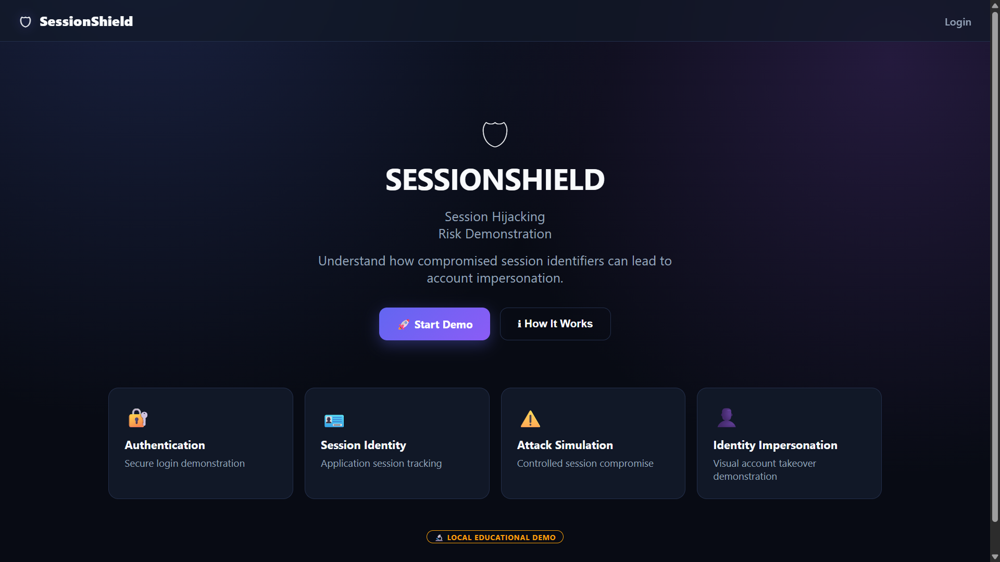
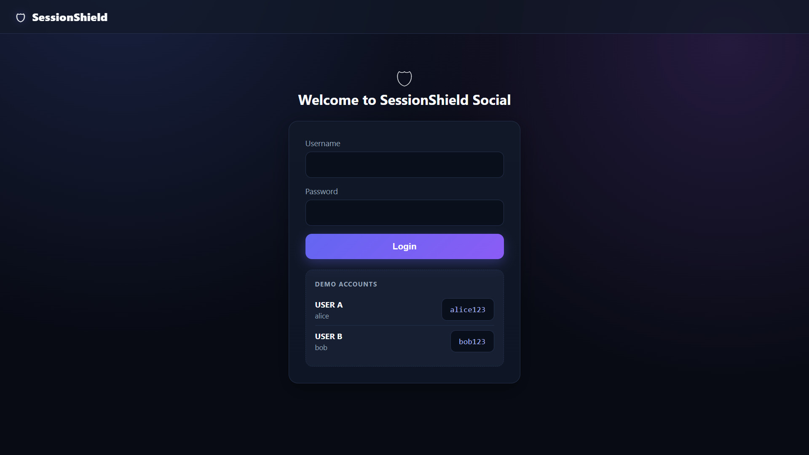
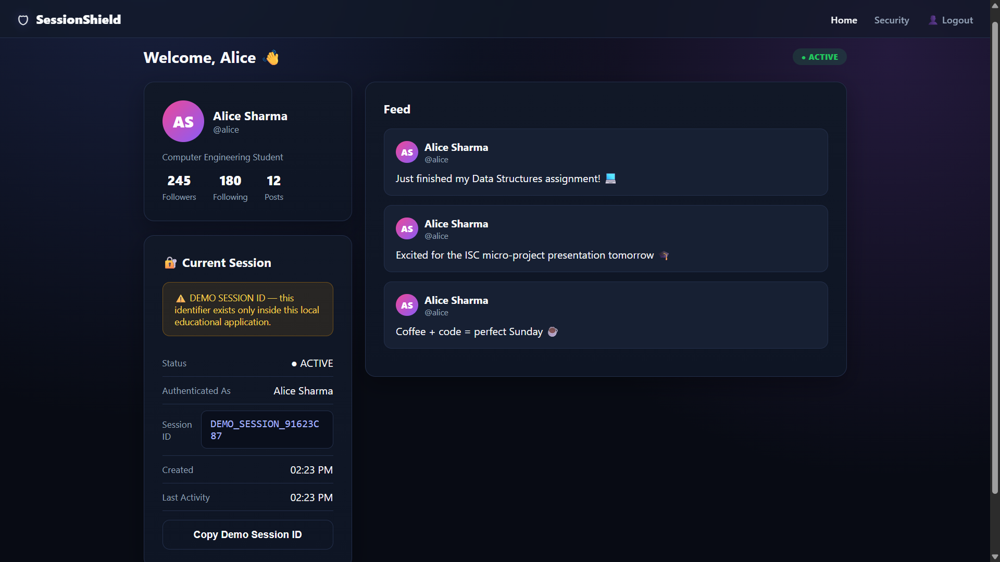
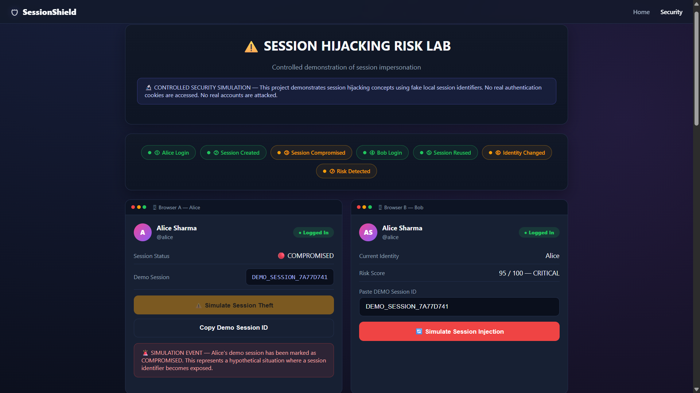
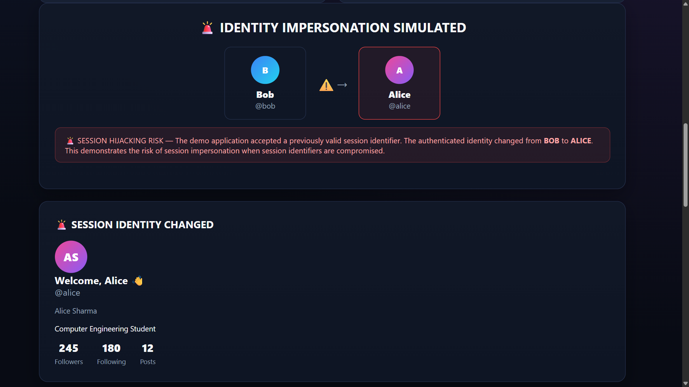
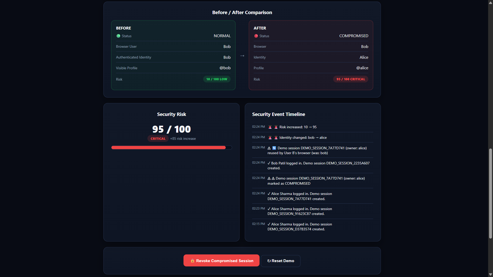

# 🛡️ SessionShield

### 🔐 Session Hijacking Risk Demonstration

> 🔬 **Educational Security Simulation**
> A local cybersecurity project that visually demonstrates how a compromised session identifier can lead to **identity impersonation**.

---

## 🎯 What We Demonstrate

```text
👩 Alice Login
      ↓
🔐 Session Created
      ↓
⚠️ Simulate Session Compromise
      ↓
🪪 Demo Session ID
      ↓
👨 Bob Login
      ↓
🔄 Simulate Session Injection
      ↓
🚨 Bob → Alice
      ↓
👩 Alice's Profile Appears
      ↓
🔴 Risk: 95/100 CRITICAL
```

---

## ✨ Features

* 🌐 Modern fake social-media platform
* 👥 Alice & Bob demo accounts
* 🔐 Fake server-controlled sessions
* ⚠️ Session compromise simulation
* 🔄 Session injection simulation
* 🚨 **Bob → Alice identity change**
* 📊 Live risk score
* 🕒 Security event timeline
* 🔒 Session revocation
* ↻ One-click demo reset

---

## 🛠️ Tech Stack

**Frontend:** HTML • CSS • JavaScript
**Backend:** Node.js • Express
**Storage:** JSON + In-memory Sessions

---

## 🚀 Run

```bash
npm install
npm start
```

Open:

```text
http://localhost:3000
```

### Demo Accounts

```text
Alice → alice / alice123
Bob   → bob / bob123
```

---

## 🎬 Key Demonstration

### Before

```text
👨 Bob
@bob
🟢 LOW — 10/100
```

### After Simulated Session Injection

```text
🚨 Identity Impersonation

👩 Alice
@alice
🔴 CRITICAL — 95/100
```

> **User B's simulated session is now treated as User A, demonstrating the risk of session hijacking.**

---
## 🖥️ Project Outputs


<p align="center">
  
  
  
</p>

### 🔐 Attack Simulation

<p align="center">
  
</p>

<p align="center">
  
</p>

<p align="center">
  
</p>

## 🔐 Safety

This project runs **only locally**.

* No real cookies
* No real accounts
* No external websites
* No real credential/session theft

The session compromise is intentionally simulated using fake session IDs.

---
## 🚀 Live Demo

🔗 **[session-hijack-demo.vercel.app](https://session-hijack-demo.vercel.app/)**

> Explore the SessionShield session hijacking security simulation.


## 🔮 Next Phase

**Project 2:** Chrome Security Extension 🛡️

```text
Detect → Risk Score → Alert → Protect
```

---

### 🛡️ SessionShield

**Simulate the Risk. Understand the Threat. Secure the Session.**
